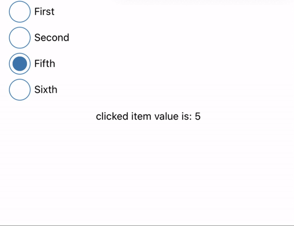

# rn-radio-button

Simple Radio Button Component for React Native - iOS and Android

[](https://npmjs.org/package/rn-radio-button)

# rn-radio-button

> simple and useful radio button component for React Native

<p>



</p>

## Installation

```sh
npm i rn-radio-button --save
```

# Getting Started

```js
import React, { useState } from "react";
import { SafeAreaView, Text, View } from "react-native";
import RadioButton from "rn-radio-button";

const App = () => {
  console.log(RadioButton);
  const [val, setVal] = useState("-");

  function pressCircle(i) {
    setVal(i);
  }

  return (
    <>
      <SafeAreaView style={{ backgroundColor: "#085b7c", flex: 0 }} />
      <SafeAreaView style={{ flex: 1, marginHorizontal: 10 }}>
        <RadioButton
          outerWidth={30}
          innerWidth={20}
          borderWidth={1}
          data={listData}
          color={"steelblue"}
          onPress={pressCircle}
          wrapperStyle={{ padding: 3 }}
        />
        <View
          style={{
            marginHorizontal: 10,
            marginVertical: 10,
            alignItems: "center"
          }}
        >
          <Text>{"clicked item value is: " + val}</Text>
        </View>
      </SafeAreaView>
    </>
  );
};

const listData = [
  { label: "First", value: 1 },
  { label: "Second", value: 2 },
  { label: "Fifth", value: 5 },
  { label: "Sixth", value: 6 }
];

export default App;
```

## Basic Usage of rn-radio-button

```js
<RadioButton
  data={listData}
  color={"steelblue"}
  onPress={val => console.log(val)}
  wrapperStyle={{ padding: 3 }}
/>
```

## Advanced Usage of rn-radio-button

```js
<RadioButton
  data={listData}
  outerWidth={30}
  innerWidth={20}
  borderWidth={1}
  color={"steelblue"}
  onPress={val => console.log(val)}
  wrapperStyle={{ padding: 3 }}
/>
```

# Parameters of rn-radio-button

| Property       | Type             | Default     | Description                                            |
| -------------- | ---------------- | ----------- | ------------------------------------------------------ |
| `data`         | array of objects | []          | Required                                               |
| `outerWidth`   | integer          | 20          | define width of outer Circle ( optional )              |
| `innerWidth`   | integer          | 10          | defined Width of inner Circle ( optional)              |
| `borderWidth`  | integer          | 1           | define borderWidth of outer Circle                     |
| `color`        | `string`         | 'steelblue' | Define primary color for inner and outer Circle        |
| `onPress`      | `function`       | -           | Define function for get value of selected radio button |
| `wrapperStyle` | `Object style`   | -           | Styling for wrap outer side of Radio Button            |
| `horizontal`   | boolean          | false       | make list of radio Button wrap Horizontally            |

# Demo

```
- cd ExampleApp/ && npm install
- cd ios && pod install
- cd .. && react-native run-ios
```
